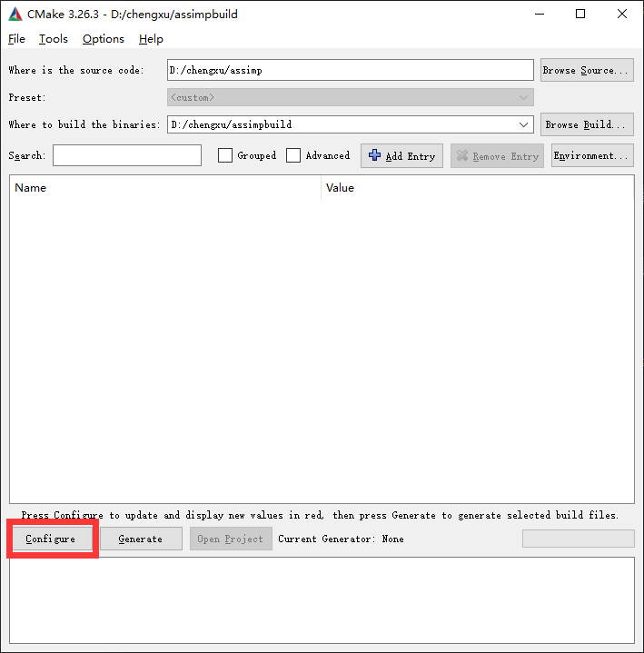
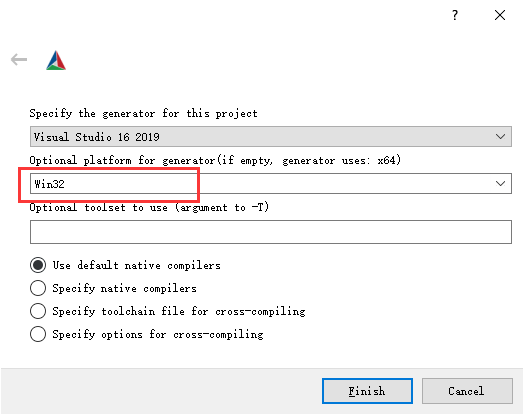
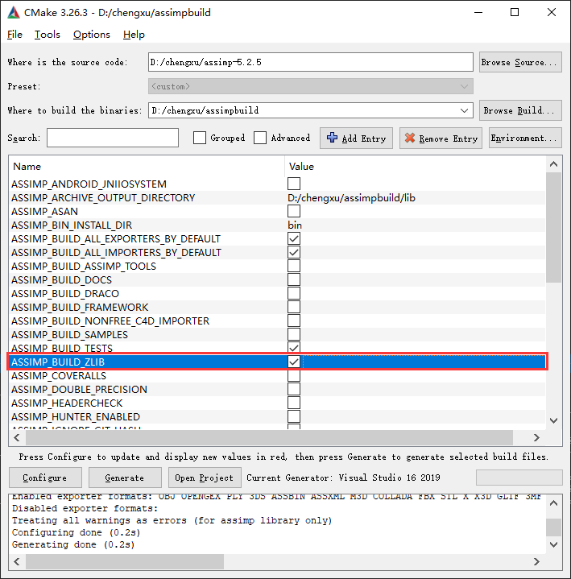
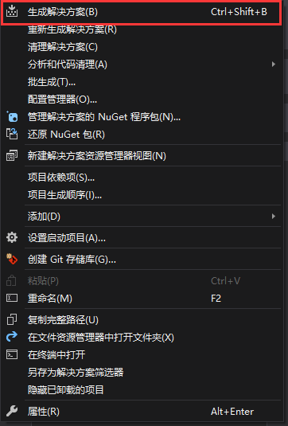
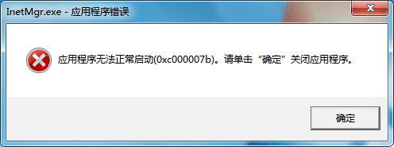
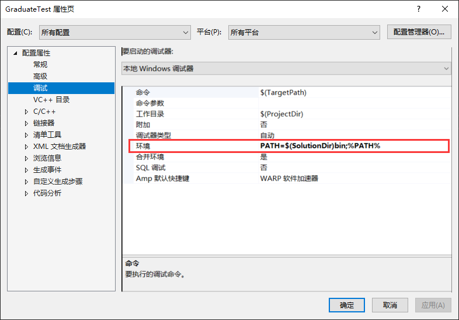

<!--
 * @Date: 2023-05-04 20:58:06
 * @LastEditors: IQQQQA
-->

## 项目中的一些问题

### 引用库
#### [GLEW]
添加库文件到目录中，除此之外需要在vc++链接器中添加静态库文件,这里使用的是二进制文件
#### [GLFW]
GLFW是一个专门针对OpenGL的C语言库，它提供了一些渲染物体所需的最低限度的接口

选择库文件下载或者Cmake编译`ShowDefaultDemo()`来显示一个预览窗口

#### [stb]
一个适用c++的文件导入的库

导入图片

`unsigned char* m_LocalBuffer = stbi_load(path.c_str(), &m_Width, &m_Height, &m_BPP, 0);`

将纹理导入gl

`glTexImage2D(GL_TEXTURE_2D, 0, format, m_Width, m_Height, 0, format, GL_UNSIGNED_BYTE, m_LocalBuffer);`
#### [ImGui] 
一个与几个图形API独立的轻量化UI图形库，导入时需要所有外文件以及对应平台文件

项目中对应
- "imgui_impl_opengl3.h"
- "imgui_impl_opengl3.cpp"
- "imgui_impl_opengl3_loader.h"
#### [glm]
基于 OpenGL 着色语言 （GLSL） 规范的图形软件的标头C++数学库。
#### [entt]
一个支持ecs架构的开源库，只有一个头文件，易于使用
- "entt.hpp"
#### [assimp]
加载3D文件的库，支持obj、fbx等40多种文件格式的导入

需要注意的是assimp与上面库不同需要用[CMake]编译生成链接库

### CMake
GitHub上很多库需要生成相应的ide工程文件然后编译对于库文件，这里用assimp库来示范。

CMake 下载完成后用GUI启动。在选择源代码位置与生成文件位置后Config配置属性

注意选择对应ide以及系统，这里使用vs2019以及win32系统

另外注意，**config后选择zlib，否则会编译失败**具体原因可能是若项目目录中不存在则优先读取anaconda中的z.lib，若anaconda中的系统与编译系统不同则会报错

生成项目后在ide中编译后就可以将库文件放在项目中了

### 项目问题

#### 应用程序违法正常启动(0x000007b)

环境缺少对应库文件，此项目目前缺少glew32.dll,freeglut.dll

**解决方法**

把对应库文件放在可执行文件目录下，或者放在ide中设置的环境变量路径下

项目参考[Cherno]、[LearnOpenGL]

[ImGui]: https://github.com/ocornut/imgui
[GLEW]:  https://glew.sourceforge.net/
[GLFW]:  https://www.glfw.org/
[stb]:   https://github.com/nothings/stb
[glm]:   https://github.com/g-truc/glm
[entt]:  https://github.com/skypjack/entt
[assimp]:https://github.com/assimp/assimp
[CMake]: https://cmake.org/
[Cherno]:https://www.youtube.com/@TheCherno
[LearnOpenGL]:https://learnopengl-cn.github.io/